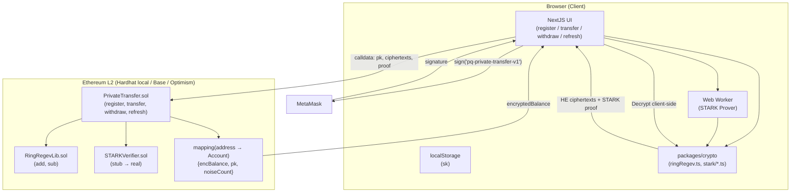
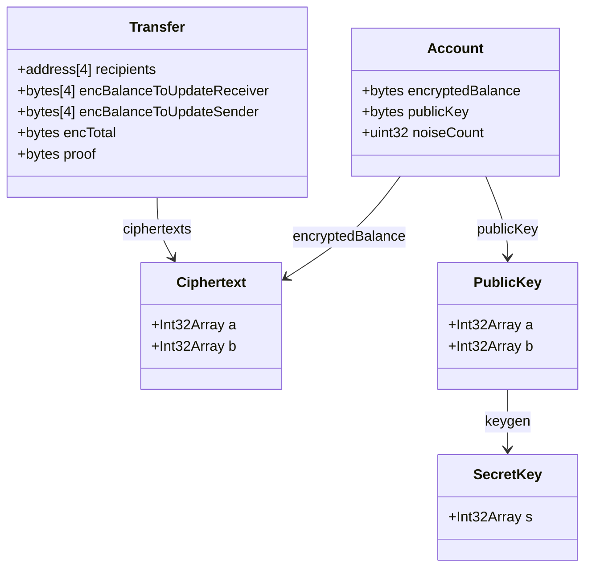

# Design — PQ Private Transfer Protocol

## 1. Overview

**Problem:** Ethereum transfers are fully transparent. The sender, recipient, and amount are all public. This exposes users to front-running, financial surveillance, and targeted attacks.

**Solution:** A post-quantum anonymous transfer protocol using:
- **Ring Regev (RLWE) homomorphic encryption** — balances stored as ciphertexts; the contract operates on them without decrypting
- **Client-side STARK proofs** — users prove transfer validity without revealing their balance or amounts
- **ORAM-inspired dummy recipients** — each transfer includes N=4 recipients (1 real + 3 dummies), making the real recipient indistinguishable on-chain

Both primitives are post-quantum secure. Ring Regev hardness relies on RLWE; STARKs use only collision-resistant hash functions.

---

## 2. Detailed Requirements

### R1 — Denomination
- Protocol unit: **szabo (1 szabo = 10¹² wei = 1 microETH)**
- Plaintext space: `Z_q`, `q = 2²⁷ = 134,217,728` → max balance ≈ 134 ETH
- Deposits must be multiples of 1 szabo
- `PROTOCOL_UNIT = 1e12` in both Solidity and TypeScript

### R2 — STARK Strategy
- Phase 2–4 use **stub proofs** (verifier always returns true in dev)
- `STARKVerifier` is an isolated, swappable interface
- Phase 1 researches Stwo (WASM), Risc0 zkVM (WASM), Winterfell (WASM)
- Non-PQ provers (Groth16) are excluded

### R3 — Noise Management
- `Account` struct has `uint32 noiseCount`; incremented each HomAdd, reset on `refresh()`
- `MAX_DUMMY_USES = 5000` hard safety guard; `transfer()` reverts if exceeded
- `refresh()` function: re-encrypts balance with fresh noise, proved by RefreshCircuit

### R4 — Key Derivation
- `keygen(seed: Uint8Array)` — deterministic from `keccak256(sign("pq-private-transfer-v1"))`
- sk stored in `localStorage`; UI shows prototype-limitation banner
- Not PQ-secure in production (ECDSA wallet is quantum-vulnerable)

### R5 — General
- N = 4 recipients per transfer (1 real + 3 dummies)
- 72 KB ciphertext calldata per transfer (acceptable on L2)
- STARK proving runs in a Web Worker (UI remains responsive)
- All 4 contract functions (register, transfer, withdraw, refresh) with 100% test coverage

---

## 3. Architecture Overview



---

## 4. Components and Interfaces

### 4.1 `packages/crypto/`

**`types.ts`**
```typescript
type Polynomial = Int32Array;           // n=1024 coefficients mod q
type Ciphertext  = [Polynomial, Polynomial]; // (a, b)
type PublicKey   = [Polynomial, Polynomial]; // (a, b = a·sk + e)
type SecretKey   = Polynomial;
type ZKProof     = Uint8Array;           // opaque bytes (stub: empty)
```

**`ringRegev.ts`**

| Export | Signature | Description |
|--------|-----------|-------------|
| `keygen` | `(seed: Uint8Array) → {pk, sk}` | Deterministic key generation |
| `encrypt` | `(m: number, pk, r: Polynomial) → Ciphertext` | Encrypt plaintext in protocol units |
| `decrypt` | `(c: Ciphertext, sk) → number` | Decrypt to protocol units |
| `add` | `(c1: Ciphertext, c2: Ciphertext) → Ciphertext` | Homomorphic add |
| `sub` | `(c1: Ciphertext, c2: Ciphertext) → Ciphertext` | Homomorphic sub |
| `encodeAmount` | `(wei: bigint) → number` | `wei / PROTOCOL_UNIT` |
| `decodeAmount` | `(units: number) → bigint` | `units * PROTOCOL_UNIT` |

All polynomial arithmetic mod `q = 2²⁷` using NTT multiplication.

**`stark/depositCircuit.ts`**
```typescript
export function proveDeposit(inputs: DepositPrivate, pub: DepositPublic): ZKProof
export function verifyDeposit(pub: DepositPublic, proof: ZKProof): boolean
```

**`stark/transferCircuit.ts`**
```typescript
export function proveTransfer(inputs: TransferPrivate, pub: TransferPublic): ZKProof
export function verifyTransfer(pub: TransferPublic, proof: ZKProof): boolean
```

**`stark/withdrawCircuit.ts`**
```typescript
export function proveWithdraw(inputs: WithdrawPrivate, pub: WithdrawPublic): ZKProof
export function verifyWithdraw(pub: WithdrawPublic, proof: ZKProof): boolean
```

**`stark/refreshCircuit.ts`**
```typescript
export function proveRefresh(inputs: RefreshPrivate, pub: RefreshPublic): ZKProof
export function verifyRefresh(pub: RefreshPublic, proof: ZKProof): boolean
```

All stub implementations return `new Uint8Array(0)` for the proof and `true` for verify. The interface is designed so the real prover is a drop-in replacement.

---

### 4.2 Smart Contracts (`packages/hardhat/contracts/`)

**`PrivateTransfer.sol`** — Main contract

```
register(pk, initialBalance, depositProof)  → payable
transfer(recipients[4], encUpdReceiver[4], encUpdSender[4], encTotal, proof)
withdraw(amount, encAmount, encNewBalance, proof)
refresh(encNewBalance, proof)
```

Data structures:
```solidity
uint256 constant PROTOCOL_UNIT = 1e12;
uint32  constant MAX_DUMMY_USES = 5000;

struct Account {
    bytes   encryptedBalance;  // ~8 KB RingRegev ciphertext
    bytes   publicKey;         // ~8 KB RingRegev public key
    uint32  noiseCount;
}

mapping(address => Account) public accounts;
uint256 public totalDeposits;
```

Events:
```solidity
event Registered(address indexed user, uint256 depositAmount);
event Transferred(address indexed sender, address[4] recipients);
event Withdrawn(address indexed user, uint256 amount);
event Refreshed(address indexed user);
```

**`RingRegevLib.sol`** — Pure Solidity library for ciphertext arithmetic

| Function | Signature | Description |
|----------|-----------|-------------|
| `add` | `(bytes a, bytes b) → bytes` | Coefficient-wise addition mod q |
| `sub` | `(bytes a, bytes b) → bytes` | Coefficient-wise subtraction mod q |

Ciphertext format: 2 × 1024 × 4 bytes = 8192 bytes as `bytes` ABI type.

**`STARKVerifier.sol`** — Stub verifier interface

```solidity
interface ISTARKVerifier {
    function verifyDeposit(bytes calldata pub, bytes calldata proof) external view returns (bool);
    function verifyTransfer(bytes calldata pub, bytes calldata proof) external view returns (bool);
    function verifyWithdraw(bytes calldata pub, bytes calldata proof) external view returns (bool);
    function verifyRefresh(bytes calldata pub, bytes calldata proof) external view returns (bool);
}

contract StubSTARKVerifier is ISTARKVerifier {
    // All functions return true — swap for real verifier in production
}
```

---

### 4.3 Frontend (`packages/nextjs/`)

**Pages:**
- `app/register/page.tsx` — Enter ETH amount, derive keypair, encrypt, prove deposit, submit tx
- `app/transfer/page.tsx` — Enter recipient + amount, auto-select 3 dummies, prove transfer, submit tx
- `app/withdraw/page.tsx` — Enter amount, prove withdrawal, submit tx
- `app/refresh/page.tsx` — One-click noise refresh

**Components:**
- `components/BalanceDisplay.tsx` — Reads encryptedBalance from chain, decrypts client-side, shows in ETH
- `components/ProofStatus.tsx` — Shows STARK prover progress (spinner + "Generating proof…")
- `components/DummyPoolStatus.tsx` — Shows count of registered accounts available as dummies
- `components/PQLimitationBanner.tsx` — Static warning about deterministic key security

**Key management (`lib/keyManager.ts`):**
```typescript
export async function deriveKey(walletClient): Promise<{pk, sk}>
// 1. Sign "pq-private-transfer-v1" with MetaMask
// 2. seed = keccak256(signature)
// 3. {pk, sk} = ringRegev.keygen(hexToBytes(seed))
// 4. sk stored in localStorage["pq-transfer-sk"]
// 5. pk returned for on-chain registration
```

**Web Worker (`workers/prover.worker.ts`):**
- Receives prove request message
- Calls appropriate circuit prover
- Posts `{proof, status}` back to main thread

---

## 5. Data Models



### Calldata Layout (Transfer)

| Field | Size | Notes |
|-------|------|-------|
| `recipients[4]` | 128 B | 4 × 20-byte addresses |
| `encBalanceToUpdateReceiver[4]` | 32 KB | 4 × 8 KB ciphertexts |
| `encBalanceToUpdateSender[4]` | 32 KB | 4 × 8 KB ciphertexts |
| `encTotal` | 8 KB | 1 × 8 KB ciphertext |
| `proof` | ~0 B (stub) | Stub: empty bytes |
| **Total** | **~72 KB** | Acceptable on L2 |

---

## 6. Error Handling

### Contract Reverts

| Condition | Revert message |
|-----------|---------------|
| Already registered | `"already registered"` |
| Deposit not multiple of PROTOCOL_UNIT | `"amount not divisible by protocol unit"` |
| Deposit amount = 0 | `"must deposit ETH"` |
| Invalid STARK proof | `"invalid proof"` |
| Recipient not registered | `"recipient not registered"` |
| noiseCount >= MAX_DUMMY_USES | `"account needs refresh"` |
| ETH transfer failed | `"ETH transfer failed"` |
| N != 4 in transfer | `"recipients must be N=4"` |
| Array length mismatch | `"length mismatch"` |

### Client-side Failures

| Failure | Handling |
|---------|----------|
| MetaMask sign rejected | Show error, allow retry |
| Web Worker prover error | Show error with details; never silently swallow |
| localStorage unavailable | Show error: "private key storage unavailable" |
| Decrypt produces out-of-range value | Show "balance corrupted — refresh needed" |
| noiseCount approaching MAX_DUMMY_USES | Show warning banner before transfer |

### Reentrancy

- `withdraw()` uses checks-effects-interactions pattern: update `encryptedBalance` before `call{value}()`
- No additional reentrancy guard needed for the other functions (no ETH transfer)

---

## 7. Testing Strategy

### Unit Tests (`packages/hardhat/test/`)

**Ring Regev library:**
- Encrypt/decrypt roundtrip for random plaintexts in `[0, q)`
- Homomorphic add: `Decrypt(Add(Enc(a), Enc(b))) == a + b`
- Homomorphic sub: `Decrypt(Sub(Enc(a), Enc(b))) == a - b`
- Noise accumulation: k HomAdds still decrypts correctly for k < MAX_DUMMY_USES

**`PrivateTransfer.sol`:**
- `register()` stores account, emits event, updates totalDeposits
- `register()` reverts if already registered
- `register()` reverts if amount not divisible by PROTOCOL_UNIT
- `transfer()` updates all 4 balances, decrements sender balance, emits event
- `transfer()` reverts for unregistered recipient
- `transfer()` reverts if noiseCount >= MAX_DUMMY_USES
- `withdraw()` pays ETH, updates balance, emits event
- `withdraw()` reverts for insufficient balance (proof-level check)
- `refresh()` resets noiseCount, updates encryptedBalance

### Integration Tests (7 required + 1)

1. **Happy path** — register, transfer, recipient withdraws; plaintext balances match
2. **Dummy recipients** — dummy balances update, real recipient gets non-zero, all ciphertexts differ
3. **Overdraft attempt** — proof generation fails before tx; or tx reverts
4. **Invalid proof** — tampered proof bytes; contract rejects
5. **Double spend** — same balance used twice; second tx fails
6. **Withdrawal underflow** — withdraw > balance; proof fails
7. **Unregistered recipient** — transfer to unregistered address; reverts
8. **Refresh** — after >5000 dummy selections, refresh resets noiseCount; transfer succeeds again

### E2E (Manual)
- Full register → transfer → withdraw flow on local Hardhat network
- STARK prover runs in Web Worker (UI responsive during proof generation)
- Balance display decrypts correctly after each operation

---

## 8. Appendices

### A. Technology Choices

| Decision | Choice | Rationale |
|----------|--------|-----------|
| HE scheme | Ring Regev (RLWE) | PQ-secure additive HE; n=1024 gives 128-bit security; q=2²⁷ fits szabo denomination |
| ZK proof system | STARK (stub → Stwo/Risc0/Winterfell) | PQ-secure (hash-based), no trusted setup, logarithmic verification |
| L2 network | Base or Optimism | 72 KB calldata is ~$0.01–$0.10 on L2 vs. $100+ on L1 |
| Smart contract framework | Hardhat | SE-2 default; good test infrastructure |
| Frontend framework | Next.js (SE-2) | Pre-configured with RainbowKit/Wagmi/Viem |
| Key derivation | Deterministic from wallet sig | Recoverable without backup; acceptable for prototype |
| Denomination | szabo (10¹² wei) | Max 134 ETH; practical for prototype; fits in q |
| Noise guard | noiseCount + MAX_DUMMY_USES=5000 + refresh() | Prevents silent decryption failure; no epoch reveals usage patterns |

### B. Alternative Approaches Considered

**Denomination alternatives:**
- gwei: max 0.134 ETH — too small
- finney: max 134,000 ETH — wastes q precision with no benefit

**Noise management alternatives:**
- Epoch-based bounding: leaks dummy usage on-chain; doesn't fix existing noise → rejected
- Automatic server-side refresh: requires trusted server → rejected (breaks client-side model)

**Key derivation alternatives:**
- Random key + localStorage: funds permanently lost on browser clear → poor DX for prototype
- Random key + password-encrypted backup: correct for production; too much UX work for prototype

**STARK prover alternatives:**
- Groth16 / Plonky2: not PQ-secure (elliptic curves) → explicitly rejected
- Blocking on real prover: freezes all other phases → rejected in favor of stub

### C. Key Constraints and Limitations

1. **Sender identity is public**: `msg.sender` is always visible on-chain. Only recipient anonymity is achieved.
2. **Key derivation is not PQ-secure**: Deterministic key from ECDSA signature is quantum-vulnerable. Documented in UI.
3. **72 KB calldata per transfer**: Practical on L2 only. L1 cost would be prohibitive.
4. **Stub STARK proofs**: Until a real WASM prover is integrated, the ZK guarantee is not enforced. This is a prototype limitation.
5. **Max 134 ETH per account**: Hard limit from q = 2²⁷ with szabo denomination. Sufficient for prototype.
6. **Noise accumulation**: Up to MAX_DUMMY_USES=5000 HomAdds before refresh required. Silent failure is prevented by on-chain guard.
7. **No sender amount privacy for withdrawal**: `amount` in `withdraw()` is a public uint256. Full privacy would require a range-proof-only circuit (possible future work).

### D. Implementation Phases

| Phase | Deliverable | Key Files |
|-------|-------------|-----------|
| 1 — Research | Library selection, gas estimates | `docs/research.md` |
| 2 — Crypto Primitives | TypeScript Ring Regev + STARK circuits | `packages/crypto/` |
| 3 — Smart Contract | PrivateTransfer.sol + tests | `packages/hardhat/contracts/`, `test/` |
| 4 — Frontend | NextJS UI, 4 pages | `packages/nextjs/app/` |
| 5 — Integration | 8 test scenarios, gas report | `packages/hardhat/test/integration/` |
