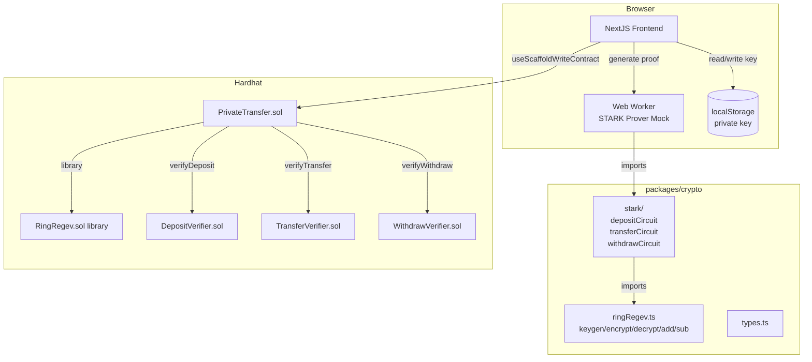
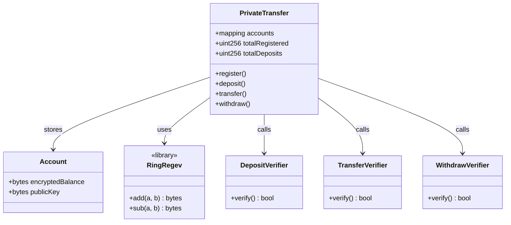
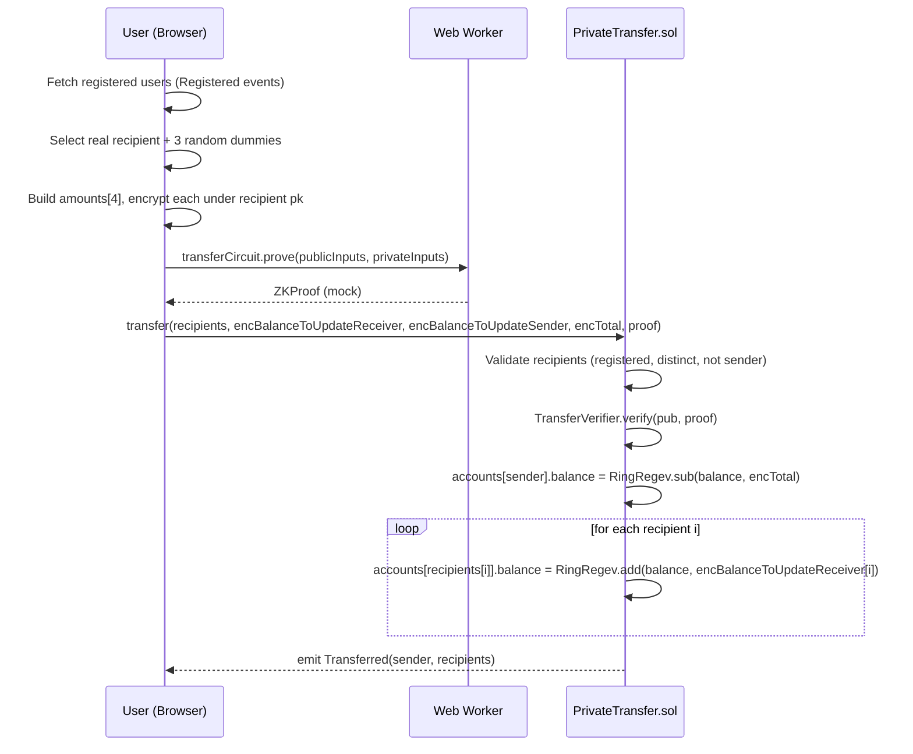

# PQ Private Transfer — Design Document

## 1. Overview

**Problem:** Standard Ethereum transfers reveal sender, recipient, and amount. Even privacy coins like Zcash rely on elliptic curve cryptography broken by Shor's algorithm.

**Solution:** A post-quantum anonymous transfer protocol where:
- Balances are stored as Ring Regev (RLWE) ciphertexts — quantum-secure additive HE
- Transfers update N=4 recipient balances atomically; an observer cannot tell which recipient is real
- Client-side STARK proofs (mock for prototype) enforce correctness without revealing plaintext values
- The contract performs only homomorphic add/sub — it never sees plaintext amounts

---

## 2. Detailed Requirements

See `requirements.md` for the full list. Key decisions from Q&A:

| # | Decision | Rationale |
|---|---|---|
| R2 | Mock STARK prover | Real RLWE STARK circuits = millions of constraints, minutes in WASM. No JS library has RLWE gadgets. |
| R3 | Block transfer when pool < 5 | Sender-as-dummy or duplicate dummies both leak information; honest failure is better |
| R4 | `deposit()` top-up in scope | Without top-up, users who spend down balance are stuck; Deposit Circuit already covers this |

---

## 3. Architecture Overview



---

## 4. Components and Interfaces

### 4.1 `packages/crypto/types.ts`

Core type definitions shared across all packages:

```typescript
type Polynomial = bigint[]               // length n=1024, coefficients in Z_q
type Ciphertext = { a: Polynomial; b: Polynomial }
type PublicKey  = { a: Polynomial; b: Polynomial }
type SecretKey  = Polynomial
type ZKProof    = { commitment: string; inputs: string[] }  // mock
```

### 4.2 `packages/crypto/ringRegev.ts`

| Export | Signature | Notes |
|---|---|---|
| `keygen` | `() => { pk: PublicKey; sk: SecretKey }` | Random `s, e, a`; `b = a·s + e` |
| `encrypt` | `(m: bigint, pk: PublicKey, r?: Polynomial) => Ciphertext` | `r` = randomness; deterministic if provided |
| `decrypt` | `(ct: Ciphertext, sk: SecretKey) => bigint` | Noise must be < q/2 |
| `add` | `(a: Ciphertext, b: Ciphertext) => Ciphertext` | Coefficient-wise addition mod q |
| `sub` | `(a: Ciphertext, b: Ciphertext) => Ciphertext` | Coefficient-wise subtraction mod q |
| `homomorphicSum` | `(cts: Ciphertext[]) => Ciphertext` | Fold of `add` |
| `serializePublicKey` | `(pk: PublicKey) => Uint8Array` | For on-chain calldata |
| `serializeCiphertext` | `(ct: Ciphertext) => Uint8Array` | For on-chain calldata |
| `deserializeCiphertext` | `(b: Uint8Array) => Ciphertext` | For client decryption |

**Polynomial multiplication:** Schoolbook O(n²) multiplication mod `x^1024 + 1`. NTT is infeasible with `q=2²⁷` because standard NTT requires a prime `q ≡ 1 (mod 2n)` — `q=2²⁷` is a power of two and does not satisfy this. Schoolbook is sufficient for the prototype (multiply is only used in `keygen` and `encrypt`, not in HE.add/sub).

### 4.3 `packages/crypto/stark/` (Mock Prover)

All three circuits expose the same interface:

```typescript
interface CircuitInputs {
  publicInputs: Record<string, unknown>
  privateInputs: Record<string, unknown>
}

async function prove(inputs: CircuitInputs): Promise<ZKProof>
async function verify(publicInputs: Record<string, unknown>, proof: ZKProof): Promise<boolean>
```

**Mock implementation:**
- `prove`: SHA-256 hash over serialized public + private inputs → `{ commitment: hash, inputs: serialized_public_inputs }`
- `verify`: checks proof format (commitment non-zero, inputs non-empty) — does NOT verify the hash. Clearly documented with `// MOCK — not real ZK` comments.

**Deposit circuit** (`depositCircuit.ts`):
```
publicInputs:  { pk, encAmount, depositAmount }
privateInputs: { r }
```

**Transfer circuit** (`transferCircuit.ts`):
```
publicInputs:  { pkB, recipientPks[4], encBalanceB, encBalanceToUpdateReceiver[4], encBalanceToUpdateSender[4], encTotal }
privateInputs: { skB, plaintextBalance, amounts[4], total, rReceiver[4], rSender[4], rTotal }
```

**Withdraw circuit** (`withdrawCircuit.ts`):
```
publicInputs:  { pkB, encBalance, encAmount, encNewBalance, amount }
privateInputs: { skB, plaintextBalance, rAmount, rNewBalance }
```

### 4.4 `packages/hardhat/contracts/PrivateTransfer.sol`

**State:**
```solidity
struct Account {
    bytes encryptedBalance; // ~8KB RingRegev ciphertext
    bytes publicKey;        // ~8KB RLWE public key
}
mapping(address => Account) public accounts;
mapping(bytes32 => bool) public usedTransfers; // keccak256(encTotal) nullifier — prevents double-spend
uint256 public totalRegistered;
uint256 public totalDeposits;
```

**Functions:**

| Function | Access | Modifiers |
|---|---|---|
| `register(bytes pk, bytes initialBalance, bytes depositProof)` | external payable | — |
| `deposit(bytes encAmount, bytes depositProof)` | external payable | mustBeRegistered |
| `transfer(address[4] recipients, bytes[4] encBalanceToUpdateReceiver, bytes[4] encBalanceToUpdateSender, bytes encTotal, bytes proof)` | external | — |
| `withdraw(uint256 amount, bytes encAmount, bytes encNewBalance, bytes proof)` | external | nonReentrant |

**`transfer` validation and balance update order (CEI):**
1. Sender registered
2. `totalRegistered >= 5` — else revert `InsufficientPool(totalRegistered, 5)`
3. All 4 recipients registered, distinct, ≠ sender
4. `nullifier = keccak256(encTotal)` not in `usedTransfers` — else revert `TransferAlreadyUsed()`
5. `TransferVerifier.verify(pub, proof)` passes
6. Update sender balance: `accounts[sender].encryptedBalance = RingRegev.sub(senderBalance, encTotal)`
7. Update each recipient: `accounts[recipients[i]].encryptedBalance = RingRegev.add(recipientBalance, encBalanceToUpdateReceiver[i])` for i in 0..3
8. Mark nullifier: `usedTransfers[nullifier] = true`

Steps 6–8 are all effects; they happen after all checks (steps 1–5) and before any external interaction. `transfer()` has no ETH transfer so no `nonReentrant` guard is needed, but all state updates complete atomically before the function returns.

**`register` CEI pattern:**
1. Check: `pk` non-empty, `accounts[msg.sender].pk` is zero (else `AlreadyRegistered()`), `DepositVerifier.verify(pub, depositProof)` passes
2. Effect: store `accounts[msg.sender] = { publicKey: pk, encryptedBalance: initialBalance }`, increment `totalRegistered`, `totalDeposits += msg.value`
3. Emit: `Registered(msg.sender, msg.value)`

**`deposit` CEI pattern:**
1. Check: registered (else `NotRegistered()`), `DepositVerifier.verify(pub, depositProof)` passes (pk read from `accounts[msg.sender].publicKey`)
2. Effect: `accounts[msg.sender].encryptedBalance = RingRegev.add(existingBalance, encAmount)`, `totalDeposits += msg.value`
3. Emit: `Deposited(msg.sender, msg.value)`

**`withdraw` CEI pattern:**
1. Check: registered, `amount > 0`, `address(this).balance >= amount` (else `InsufficientContractBalance()`), proof valid
2. Effect: update `encryptedBalance = encNewBalance`, `totalDeposits -= amount`
3. Interact: `msg.sender.call{value: amount}("")`

**`deposit` public key resolution:**
`deposit(bytes encAmount, bytes depositProof)` reads `accounts[msg.sender].publicKey` from storage to build the verifier public inputs. The caller does not pass `pk` — it is always the stored key for the calling account.

### 4.5 `packages/hardhat/contracts/RingRegev.sol`

Solidity library:
- `add(bytes memory a, bytes memory b) internal pure returns (bytes memory)` — coefficient-wise add mod q; decodes raw 4-byte LE bytes via manual loop (not `abi.decode` — ABI pads each `uint32` to 32 bytes, producing 32768 bytes, not 4096)
- `sub(bytes memory a, bytes memory b) internal pure returns (bytes memory)` — coefficient-wise sub mod q

**Serialization contract:**
A `Polynomial` (`bigint[1024]`) is serialized as `4096 bytes` (little-endian, 4 bytes per coefficient, coefficients in `[0, 2²⁷)`). A `Ciphertext` (`{ a, b }`) is serialized as `8192 bytes` = `a || b`. A `PublicKey` is serialized identically to `Ciphertext` (same structure). All on-chain `bytes` fields follow this layout.

TypeScript helpers in `packages/crypto/src/ringRegev.ts`:
- `serializePolynomial(p: Polynomial): Uint8Array` — write each `bigint` as 4-byte LE
- `deserializePolynomial(b: Uint8Array): Polynomial` — read 4-byte LE chunks

No ABI encoding overhead — raw byte packing avoids 32-byte slot padding for large arrays.

### 4.6 STARK Verifier Contracts

Three separate contracts, one per circuit. Each `verify()` function deserializes the proof bytes, checks commitment is non-zero and inputs field is non-empty. Does not cryptographically verify — matches the mock prover.

### 4.7 Frontend Pages

**`/register`:** generate keypair → store sk in localStorage → encrypt msg.value → prove (Web Worker) → `register(pk, initialBalance, proof)`; "Top-up" button calls `deposit()`.

**`/transfer`:** fetch registered users from events → check pool ≥ 5 → select 3 dummies → build amounts[4] → prove (Web Worker) → `transfer(...)`.

**`/withdraw`:** decrypt balance (show client-side) → encrypt withdrawal amount and new balance → prove (Web Worker) → `withdraw(amount, encAmount, encNewBalance, proof)`.

**Components:**
- `BalanceDisplay` — reads `accounts[address].encryptedBalance` via `useScaffoldReadContract`, decrypts with sk from localStorage
- `ProofStatus` — spinner while Web Worker runs
- `DummyPoolStatus` — shows registered count, warns when < 5

---

## 5. Data Models



---

## 6. End-to-End Sequence (Transfer)



---

## 7. Error Handling

| Error | Type | Trigger |
|---|---|---|
| `AlreadyRegistered()` | custom | `register()` called by registered address |
| `NotRegistered()` | custom | `deposit()`/`withdraw()` by unregistered address |
| `InsufficientPool(uint256 have, uint256 need)` | custom | `transfer()` when `totalRegistered < 5` |
| `InvalidProof()` | custom | Verifier returns false |
| `InvalidRecipients()` | custom | Duplicate/unregistered recipients or self as recipient |
| `ZeroAmount()` | custom | `withdraw()` with `amount == 0` |
| `InsufficientContractBalance()` | custom | `address(this).balance < amount` in `withdraw()` |
| `ETHTransferFailed()` | custom | Low-level call fails in `withdraw()` |
| `TransferAlreadyUsed()` | custom | `keccak256(encTotal)` already in `usedTransfers` |

---

## 8. Testing Strategy

### Unit Tests (Hardhat)

| Target | Tests |
|---|---|
| `RingRegev.sol` | add/sub roundtrip, overflow/underflow mod q |
| `DepositVerifier.sol` | accepts valid proof, rejects malformed proof |
| `TransferVerifier.sol` | accepts valid proof, rejects malformed proof |
| `WithdrawVerifier.sol` | accepts valid proof, rejects malformed proof |
| `PrivateTransfer.register()` | stores account, increments totalRegistered, rejects re-registration |
| `PrivateTransfer.deposit()` | adds to balance via HE.add, rejects unregistered |
| `PrivateTransfer.transfer()` | updates all 4 balances, rejects bad pool, rejects duplicates, rejects self |
| `PrivateTransfer.withdraw()` | pays ETH, updates balance, reentrancy guard |

### TypeScript Unit Tests (packages/crypto)

| Target | Tests |
|---|---|
| `ringRegev.ts` | encrypt/decrypt roundtrip, HE.add preserves sum, HE.sub preserves diff |
| `depositCircuit.ts` | prove/verify roundtrip |
| `transferCircuit.ts` | prove/verify roundtrip |
| `withdrawCircuit.ts` | prove/verify roundtrip |

### Integration Test Scenarios

1. **Happy path** — register → transfer (real recipient receives, dummies get 0) → withdraw
2. **Dummy balance** — dummy addresses' decrypted balances unchanged after transfer
3. **Overdraft** *(mock-prover limitation — client-side only)* — transfer amount > balance: proof construction fails in the TypeScript client because private inputs violate circuit constraint 2. A malicious actor bypassing the client can submit a forged proof; the mock verifier cannot detect this. Real enforcement requires production ZK circuits.
4. **Invalid proof** — tampered proof bytes: `InvalidProof()` revert
5. **Double spend** — same encTotal submitted twice: second tx fails
6. **Withdrawal underflow** *(mock-prover limitation — client-side only)* — withdraw more than balance: proof construction fails in the TypeScript client because private inputs violate circuit constraint 2. Same mock-prover caveat as scenario 3.
7. **Unregistered recipient** — `InvalidRecipients()` revert

---

## 8a. Mock-Prover Limitations

The prototype mock prover accepts any well-formed proof (non-zero commitment, non-empty inputs). The following properties are **NOT enforced** by the on-chain contract and are only enforced by the honest TypeScript client:

| Property | Who enforces it | What a malicious actor can bypass |
|---|---|---|
| Sender balance ≥ transfer total | Client (circuit constraint 2) | Overdraft: send more than balance |
| Withdrawal amount ≤ balance | Client (circuit constraint 2) | Underflow: withdraw more than balance |
| Amounts sum to total | Client (circuit constraint 3) | Send inconsistent amounts |
| Ciphertexts correctly encrypted | Client (circuit constraints 5–7) | Send arbitrary ciphertexts |

**These limitations are known and expected for the prototype.** Production deployment requires replacing the mock with real STARK circuits that cryptographically enforce all constraints. The double-spend prevention (`usedTransfers` nullifier) IS enforced on-chain independently of the proof.

---

```
packages/
  crypto/
    src/
      ringRegev.ts
      stark/
        depositCircuit.ts
        transferCircuit.ts
        withdrawCircuit.ts
      types.ts
    package.json
    tsconfig.json

  hardhat/
    contracts/
      PrivateTransfer.sol
      RingRegev.sol
      verifiers/
        DepositVerifier.sol
        TransferVerifier.sol
        WithdrawVerifier.sol
    deploy/
      01_deploy_ring_regev.ts
      02_deploy_verifiers.ts
      03_deploy_private_transfer.ts
    test/
      PrivateTransfer.test.ts
      RingRegev.test.ts

  nextjs/
    app/
      register/page.tsx
      transfer/page.tsx
      withdraw/page.tsx
    components/
      BalanceDisplay.tsx
      ProofStatus.tsx
      DummyPoolStatus.tsx
    workers/
      starkProver.worker.ts
```

---

## 10. Appendices

### A. Technology Choices

| Component | Choice | Reason |
|---|---|---|
| HE | Ring Regev (RLWE), custom TypeScript | Only PQ-secure additive HE feasible in browser; no suitable JS lib exists |
| STARK Prover | Mock (SHA-256 commitment) | Real RLWE STARK = millions of constraints, no JS WASM lib has RLWE gadgets |
| Polynomial multiplication | Schoolbook O(n²) | NTT requires prime q ≡ 1 (mod 2n); q=2²⁷ is not prime. Schoolbook is sufficient — multiply only used in keygen/encrypt, not HE.add/sub |
| Solidity HE | Coefficient-wise add/sub only | HE.add/sub on ciphertexts is polynomial addition — no NTT needed on-chain |
| L2 | Optimism or Base (confirmed by Phase 1 research) | 72KB calldata costs ~$0.5 on L2 vs ~$50 on mainnet |

### B. Alternatives Considered

| Alternative | Rejected Because |
|---|---|
| Groth16/Plonk instead of STARK | Elliptic curve based — not PQ secure |
| FHE (BFV/CKKS) instead of Ring Regev | Multiplicative depth not needed; Ring Regev is simpler |
| Sender-as-dummy for small pools | Leaks information — reduces effective anonymity set |
| Single monolithic verifier contract | Harder to swap mock for real prover per circuit |

### C. Key Constraints and Limitations

1. **Sender is always visible** — `msg.sender` is public. Only recipient anonymity is provided.
2. **Mock STARK is not real ZK** — no actual zero-knowledge in the prototype. Must be prominently documented in UI and README.
3. **Ciphertext ~8KB per slot** — each account uses ~16KB on-chain storage (balance + pk). Expensive on mainnet, acceptable on L2 for a prototype.
4. **No key rotation** — `pk` is permanent once registered.
5. **localStorage key storage** — private key is not hardware-protected. Acceptable for prototype only.
6. **Noise budget** — Ring Regev noise grows with each HE.add. For `n=1024, q=2²⁷`, the budget supports ~50 homomorphic additions before decryption risk. This is a known limitation of the prototype; no in-UI warning is implemented (would require client-side received-transfer counting, which is left for a future iteration).
