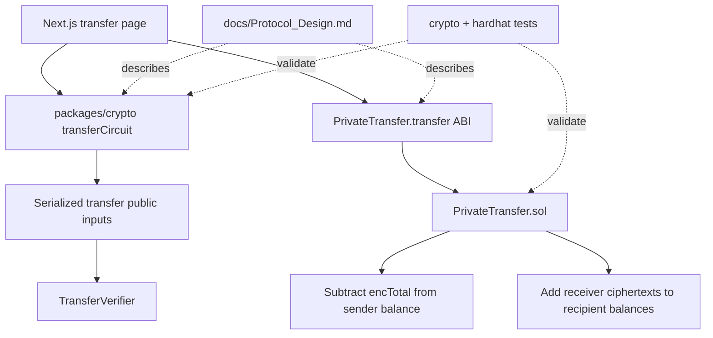
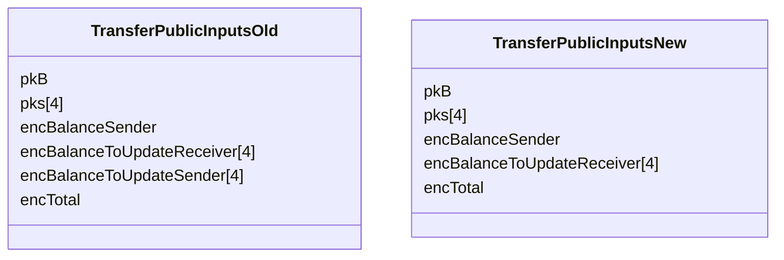

# Design — Remove `enc_balance_to_update_sender`

## 1. Overview

The current transfer protocol carries two sender-side ciphertext representations of the same economic deduction:
`enc_balance_to_update_sender[N]` for each per-recipient amount under the sender key, and `enc_total` for the total amount under the sender key.
Only `enc_total` is consumed on-chain for sender balance updates, while `enc_balance_to_update_sender[N]` exists only to support a proof-level homomorphic sum check.

This design removes the redundant sender ciphertext array and its witness randomness, keeps `enc_total` as the sole sender-deduction ciphertext, and updates the repository atomically across protocol docs, crypto proof serialization, contract ABI, frontend submission flow, and tests.
The change is intentionally breaking: old transfer proofs and callers are not supported after the update.

## 2. Detailed Requirements

1. Remove `enc_balance_to_update_sender[N]` from the transfer protocol data model and all transfer APIs.
2. Remove `r_sender[N]` from transfer private inputs and witness construction.
3. Remove transfer constraint 8 (`HomomorphicSum(enc_balance_to_update_sender[N]) == enc_total`) entirely.
4. Preserve transfer soundness through constraints tying `total` to `amounts[N]` and `enc_total` to `Encrypt(total, pkB, r_total)`.
5. Update transfer public-input serialization so it contains only:
   - sender public key
   - recipient public keys
   - sender encrypted balance
   - recipient update ciphertexts
   - `enc_total`
6. Update `PrivateTransfer.transfer` so it accepts recipient addresses, recipient update ciphertexts, `encTotal`, proof commitment, and proof inputs only.
7. Update frontend callers to stop generating and submitting the removed sender array.
8. Update generated/deployed ABI artifacts that mirror the Solidity signature.
9. Update tests to validate only the new layout.
10. Document the calldata reduction and the repo-wide breaking change.

## 3. Architecture Overview



### Design summary

The new architecture removes one data lane entirely:
there is no longer a sender per-recipient ciphertext array flowing from UI to proof serialization to contract ABI.
The sender-deduction path now uses only `enc_total`, which is already bound to the constrained plaintext `total` inside the transfer proof.

## 4. Components and Interfaces

### 4.1 Protocol documentation

**Primary file:** `docs/Protocol_Design.md`

Responsibilities:
- update transfer calldata estimates
- update the `Transfer` data structure
- update transfer public/private inputs and outputs
- delete constraint 8 and its explanatory note
- reflect the new transfer call surface

Planned documentation changes:
- remove the 32 KB sender-array calldata line item
- reduce total ciphertext calldata accordingly
- remove `enc_balance_to_update_sender[N]` from `Transfer`
- remove `r_sender[N]` from private inputs
- remove constraint 8 prose and numbering references

### 4.2 Crypto transfer circuit surface

**Primary file:** `packages/crypto/src/stark/transferCircuit.ts`

Current interface:
- `TransferPublicInputs` includes `encBalanceToUpdateSender`
- `TransferPrivateInputs` includes `rSender`
- `serializeTransferPublic` serializes the sender array into proof inputs

Target interface:
- `TransferPublicInputs` removes `encBalanceToUpdateSender`
- `TransferPrivateInputs` removes `rSender`
- `serializeTransferPublic` omits the sender array and therefore produces a shorter byte layout

Impact:
- `proveTransfer` and `verifyTransfer` continue to work with the same mock strategy, but over the reduced public-input layout
- any consumer that constructs transfer proofs must update to the new TypeScript types

### 4.3 Solidity transfer entrypoint

**Primary file:** `packages/hardhat/contracts/PrivateTransfer.sol`

Current signature:

```solidity
transfer(address[] recipients, bytes[] encBalanceToUpdateReceiver, bytes[] encBalanceToUpdateSender, bytes encTotal, bytes32 commitment, bytes proofInputs)
```

Target signature:

```solidity
transfer(address[] recipients, bytes[] encBalanceToUpdateReceiver, bytes encTotal, bytes32 commitment, bytes proofInputs)
```

Behavioral changes:
- remove the extra calldata argument
- remove the receiver/sender dual-array length check and keep only the receiver length check against `recipients`
- preserve all registration, distinct-recipient, nullifier, verifier, debit, and credit logic
- sender deduction continues to use `RingRegev.sub(accounts[msg.sender].encryptedBalance, encTotal)`

### 4.4 Frontend transfer flow

**Primary file:** `packages/nextjs/app/transfer/page.tsx`

Current behavior:
- encrypt amounts for each recipient key
- separately encrypt the same amounts under the sender key
- encrypt `total` under the sender key
- prove with both receiver ciphertexts and sender ciphertexts
- submit both arrays plus `encTotal`

Target behavior:
- keep recipient-key ciphertext generation
- remove sender-key per-recipient ciphertext generation
- keep `encTotal` generation
- call `proveTransfer` with the reduced public/private input shapes
- submit only recipient ciphertexts, `encTotal`, commitment, and proof inputs

Secondary impact:
- remove now-unused frontend imports related to the deleted sender-array path
- keep UX and dummy-recipient selection unchanged

### 4.5 Generated ABI artifacts

**Primary files:**
- `packages/nextjs/contracts/deployedContracts.ts`
- any regenerated deployment artifacts that mirror the contract ABI

Responsibilities:
- reflect the new transfer signature so typed frontend hooks and contract metadata remain aligned

Constraint:
- these files should be regenerated by the repository's normal compile/deploy flow rather than hand-maintained if that is already the project pattern

### 4.6 Test suites

**Primary files:**
- `packages/crypto/src/stark/transferCircuit.test.ts`
- `packages/hardhat/test/PrivateTransfer.test.ts`

Responsibilities:
- remove sender-array fixtures and expectations
- update transfer proof construction helpers to the new type surface
- update contract invocation helpers to the new ABI
- preserve coverage for success path, invalid proof rejection, nullifier replay, recipient validation, and other existing transfer checks

## 5. Data Models

### 5.1 Transfer protocol model

#### Before

```text
Transfer {
  recipients[N]
  enc_balance_to_update_receiver[N]
  enc_balance_to_update_sender[N]
  enc_total
  proof
}
```

#### After

```text
Transfer {
  recipients[N]
  enc_balance_to_update_receiver[N]
  enc_total
  proof
}
```

### 5.2 Transfer witness model

#### Before

```text
TransferPrivateInputs {
  pvkB
  plainBalance
  amounts[N]
  total
  rReceiver[N]
  rSender[N]
  rTotal
}
```

#### After

```text
TransferPrivateInputs {
  pvkB
  plainBalance
  amounts[N]
  total
  rReceiver[N]
  rTotal
}
```

### 5.3 Serialization model



Implication:
- proof byte length decreases by four serialized ciphertexts
- any proof serialized with the old layout will fail verification against the new expected byte sequence

## 6. Error Handling

### Expected failure modes

1. **Old callers against new ABI**
   - Symptom: contract invocation fails at compile time, type generation time, or runtime due to signature mismatch.
   - Handling: treat as an intentional breaking change; update generated ABIs and frontend callers atomically.

2. **Old proofs against new public-input layout**
   - Symptom: transfer verifier rejects proof inputs because the serialized bytes no longer match the new layout.
   - Handling: no compatibility shim; regenerate proofs using the new crypto package flow.

3. **Partially updated repo surfaces**
   - Symptom: compile or test failures when one package still references `encBalanceToUpdateSender` or `rSender`.
   - Handling: perform repo-wide search-based cleanup and validate with existing test/build commands.

4. **Length-validation regressions in the contract**
   - Symptom: mismatched recipient and receiver ciphertext arrays are not rejected correctly after the sender-array check is removed.
   - Handling: retain an explicit `recipients.length == encBalanceToUpdateReceiver.length` check and cover it in tests.

### Error-handling principle

This change should not introduce silent fallbacks or dual parsing modes.
A transfer either matches the new layout everywhere or it should fail explicitly through type errors, proof verification failure, or contract ABI mismatch.

## 7. Testing Strategy

### Unit and package tests

1. Update `packages/crypto/src/stark/transferCircuit.test.ts` to construct proofs without `encBalanceToUpdateSender` and `rSender`.
2. Keep positive verification tests to confirm the reduced public-input serialization still round-trips through `proveTransfer` and `verifyTransfer`.
3. Keep negative tests that mutate public inputs or proof bytes and ensure verification fails.
4. Add or preserve assertions that encode the new public-input shape, not the legacy one.

### Contract tests

1. Update `packages/hardhat/test/PrivateTransfer.test.ts` to call the new `transfer` signature.
2. Preserve existing transfer behavior checks:
   - successful transfer updates sender and recipient balances
   - invalid proof reverts
   - replayed commitment reverts
   - unregistered or duplicate recipients revert
   - pool-size checks remain intact
3. Keep coverage around array length mismatch using the remaining receiver-array validation.

### Build and integration validation

1. Run the repository compile/build flow so generated ABIs reflect the updated Solidity signature.
2. Run the existing test suites for crypto and contract packages.
3. Optionally verify the Next.js transfer page compiles against regenerated ABIs if the normal repo build already covers it.

## 8. Appendices

### A. Technology choices

#### Choice: use only `enc_total` for sender deduction

Pros:
- removes redundant calldata and witness data
- simplifies proof public-input serialization
- simplifies the contract ABI and frontend call path
- preserves the correctness property the contract actually consumes

Cons:
- breaks compatibility with existing proofs and callers
- removes a previously explicit homomorphic relation, even though it was redundant for the current design

### B. Alternatives considered

1. **Keep constraint 8 as a hidden internal check**
   - Rejected because it requires retaining the removed sender-array witness structure with no on-chain consumer and little security benefit beyond constraints 3 and 7.

2. **Support both old and new proof layouts in parallel**
   - Rejected because it would add versioning complexity across crypto serialization, ABI surfaces, frontend logic, and tests for a prototype repo.

3. **Replace sender-array sum checking with receiver ciphertext composition**
   - Rejected because recipient ciphertexts are under different public keys and cannot algebraically compose into `enc_total` under the sender key.

### C. Constraints and limitations

- This repository uses a mock transfer prover/verifier path today, so serialization shape is the binding compatibility point for tests and consumers.
- The change must remain repo-wide and atomic; partial rollout is not supported.
- Generated ABI artifacts must be kept in sync with the Solidity change.
